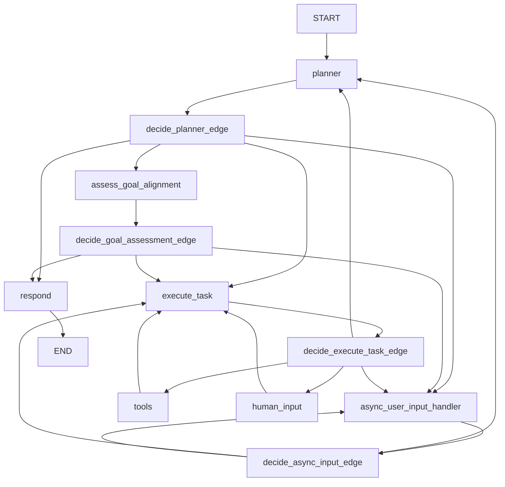

# Enhanced Planner Style Agent

The Enhanced Planner Style Agent is an advanced implementation of the original planner strategy that includes three major enhancements:

1. **Goal Tracking Foundation** - Persistent user goal management with plan-goal alignment assessment
2. **Custom Tools Infrastructure** - Extensible framework for adding custom tools alongside MCP tools  
3. **Asynchronous User Input** - Real-time user input handling during task execution

## Table of Contents

- [Overview](#overview)
- [Core Architecture](#core-architecture)
- [Goal Tracking System](#goal-tracking-system)
- [Custom Tools Infrastructure](#custom-tools-infrastructure)
- [Asynchronous User Input](#asynchronous-user-input)
- [Configuration](#configuration)
- [State Management](#state-management)
- [Graph Workflow](#graph-workflow)
- [Usage Examples](#usage-examples)
- [Development Guide](#development-guide)
- [API Reference](#api-reference)

## Overview

The Enhanced Planner Style Agent builds upon the original planner strategy by adding sophisticated goal management, custom tool support, and real-time user interaction capabilities. This creates a more intelligent and flexible assistant that can:

- Track user goals across multiple conversation turns
- Assess whether plans align with stated goals
- Use both MCP tools and custom-built tools
- Accept user input at any time during task execution
- Dynamically adjust plans based on goal changes

## Core Architecture

### Files Structure

```
src/langgraph_mcp/
├── tools.py               # All tools functionality (framework, registry, implementations, merging)
├── utils.py               # Utilities including AsyncInputManager
└── goal_oriented/
    ├── __init__.py        # Module initialization
    ├── config.py          # Enhanced configuration with goal assessment
    ├── state.py           # Extended state with goal tracking and async input
    ├── graph.py           # Enhanced graph with new nodes and edges
    └── prompts.py         # Updated prompts for goal awareness
```

### New Components

- **Goal Assessment Node**: Evaluates plan-goal alignment
- **Async User Input Handler**: Processes real-time user input
- **Custom Tools Integration**: Merges MCP and custom tools
- **Tool Merger Functions**: Unified tool execution system

## Goal Tracking System

### Key Features

- **Persistent Goal Storage**: User goals persist across plan changes
- **Goal-Plan Alignment**: Automatic assessment of whether plans support user goals
- **Goal Change Detection**: Tracks when goals are updated
- **Alignment Scoring**: Numerical confidence scores for goal-plan alignment

### Goal Assessment

The system uses a dedicated LLM to assess whether current plans align with user goals:

```python
class GoalAssessmentResult(BaseModel):
    is_aligned: bool                    # Whether plan aligns with goal
    alignment_score: float              # Confidence score (0-1)
    explanation: str                    # Detailed reasoning
    missing_elements: list[str]         # What's missing from the plan
    suggested_improvements: list[str]   # How to improve alignment
```

### Goal-Aware Planning

The planner system prompt includes goal context:

```
**CRITICAL: Goal Alignment**
The user has an overarching goal: {user_goal}

ALL PLANS MUST ALIGN WITH THIS GOAL. When creating or continuing a plan:
1. Ensure every task directly contributes to achieving the user's goal
2. If the user makes a new request, verify it aligns with their stated goal
3. If the user's request conflicts with their goal, ask for clarification
```

## Custom Tools Infrastructure

### Architecture

The custom tools system provides a framework for creating tools that work alongside MCP tools:

```
Custom Tool Framework:
├── CustomToolFunction (abstract base class)
├── Global tools registry (dict-based tool storage)
└── Tool merger functions (unified tool access)
```

### Creating Custom Tools

Implement the `CustomToolFunction` interface:

```python
class MyCustomTool(CustomToolFunction):
    @property
    def name(self) -> str:
        return "my_tool"
    
    @property
    def description(self) -> str:
        return "Description of what the tool does"
    
    @property
    def parameters(self) -> Dict[str, Any]:
        return {
            "type": "object",
            "properties": {
                "param1": {"type": "string", "description": "Parameter description"}
            },
            "required": ["param1"]
        }
    
    async def execute(self, **kwargs) -> str:
        # Tool implementation
        return "Tool result"
```

### Built-in Custom Tools

Four example tools are included:

1. **GrepSearchTool** (`grep_search`): Search text patterns in files using regex
2. **FileReadTool** (`file_read`): Read file contents with options for partial reading
3. **FileListTool** (`file_list`): List files and directories with filtering
4. **ShellCommandTool** (`shell_command`): Execute shell commands on the local system

### Shell Command Tool

The `ShellCommandTool` is a powerful addition that allows the agent to execute shell commands locally. This tool provides:

- **Command Execution**: Run any shell command on the local system
- **Working Directory Control**: Specify the directory where commands should be executed
- **Output Capture**: Option to capture and return command output
- **Security Safeguards**: Built-in protection against dangerous commands
- **Timeout Management**: Configurable timeout to prevent long-running commands
- **Error Handling**: Comprehensive error reporting and handling

#### Security Features

The shell command tool includes several security measures:

- Blocks potentially dangerous commands (rm -rf /, shutdown, etc.)
- Validates working directory existence
- Uses subprocess isolation
- Implements command timeout
- Captures and sanitizes output

#### Usage Examples

```python
# Create a directory
shell_command(command="mkdir my_website", working_directory=".")

# Install dependencies
shell_command(command="npm install", working_directory="./my_website")

# Start a development server
shell_command(command="npm start", working_directory="./my_website", timeout=60)

# List files
shell_command(command="ls -la", working_directory="./my_website")
```

### Website Generation and Deployment

With the shell command tool, the enhanced planner can now:

- Create project directories and files
- Install dependencies using package managers (npm, pip, etc.)
- Run build tools and bundlers
- Start development servers
- Deploy applications to various platforms
- Execute any command-line tool or script

This enables the agent to generate and deploy complete websites using modern web development workflows.

### Tool Merger

The tool merger functions provide unified access to both MCP and custom tools:

```python
# Get all available tools (MCP + custom)
tools = await get_merged_tools(server_name, server_config)

# Execute any tool (automatically routes to correct handler)
result = await execute_merged_tool(tool_name, tool_args, server_name, server_config)

# Check if a tool is custom
is_custom = is_custom_tool(tool_name)
```

## Asynchronous User Input

### Key Features

- **Real-time Input**: Users can provide input at any time during task execution
- **Input Queueing**: Multiple inputs are queued and processed in order
- **Goal Updates**: Automatic detection of goal changes in user input
- **Seamless Integration**: User input is processed without breaking the execution flow

### Implementation

The async input system uses:

- **Input Queue**: `pending_user_input` list in state
- **Timestamp Tracking**: `user_input_timestamp` for input timing
- **External State Updates**: Updates state without interrupting execution
- **Conditional Routing**: All graph edges check for pending input

### User Input Processing

```python
async def async_user_input_handler(state: State, *, config: RunnableConfig):
    """Handle asynchronous user input during task execution."""
    
    # Process pending inputs
    if state.pending_user_input:
        current_input = state.pending_user_input[0]
        remaining_inputs = state.pending_user_input[1:]
        
        # Check for goal updates
        if any(keyword in current_input.lower() for keyword in ['goal', 'objective', 'purpose']):
            return {
                "pending_user_input": remaining_inputs,
                "user_goal": current_input,
                "goal_last_updated": datetime.now(),
                "messages": [HumanMessage(content=current_input)]
            }
```

## Configuration

### Enhanced Configuration Options

```python
@dataclass(kw_only=True)
class Configuration:
    # Standard planner options
    planner_system_prompt: str
    planner_model: str
    execute_task_system_prompt: str
    execute_task_model: str
    generate_response_system_prompt: str
    generate_response_model: str
    
    # New goal assessment options
    goal_assessment_system_prompt: str
    goal_assessment_model: str
    
    # MCP server configuration
    mcp_server_config: dict[str, Any]
```

### Goal Assessment Configuration

The goal assessment system uses its own LLM and prompt:

```python
goal_assessment_system_prompt: str = field(
    default=prompts.GOAL_ASSESSMENT_SYSTEM_PROMPT,
    metadata={"description": "System prompt for assessing goal-plan alignment"}
)

goal_assessment_model: str = field(
    default="openai/gpt-4o",
    metadata={"description": "LLM for goal assessment"}
)
```

## State Management

### Enhanced State Fields

```python
@dataclass(kw_only=True)
class State(InputState):
    # Original fields
    planner_result: Optional[PlannerResult] = None
    task_completed: bool = False
    
    # Goal tracking fields
    user_goal: Optional[str] = None
    goal_last_updated: Optional[datetime] = None
    goal_assessment: Optional[GoalAssessmentResult] = None
    
    # Async input fields
    pending_user_input: list[str] = field(default_factory=list)
    user_input_timestamp: Optional[datetime] = None
```

### State Transitions

The enhanced state supports:

- **Goal Persistence**: Goals survive plan changes and conversation turns
- **Assessment Caching**: Goal assessment results are stored in state
- **Input Queueing**: Multiple user inputs can be queued
- **Timestamp Tracking**: All goal and input changes are timestamped

## Graph Workflow

### Enhanced Node Flow



### New Nodes

1. **assess_goal_alignment**: Evaluates whether the current plan aligns with user goals
2. **async_user_input_handler**: Processes real-time user input and goal updates

### Enhanced Conditional Edges

All conditional edges now check for pending user input:

```python
def decide_planner_edge(state: State) -> str:
    # Check for pending user input first
    if has_pending_user_input(state):
        return "async_user_input_handler"
    
    if state.planner_result and state.planner_result.get_current_task():
        if state.user_goal:
            return "assess_goal_alignment"  # New goal assessment step
        else:
            return "execute_task"
    
    return "respond"
```

## Usage Examples

### Basic Goal Tracking

```python
# User sets a goal
user: "My goal is to create a simple website for my portfolio"

# Agent tracks this goal and ensures all plans align with it
# Future requests are evaluated against this goal
```

### Custom Tool Usage

```python
# Agent can use custom grep tool
user: "Find all Python files that import requests"

# Agent uses grep_search custom tool:
# grep_search(pattern="import requests", file_path=".", include_line_numbers=True)
```

### Asynchronous Input

```python
# During task execution, user can provide additional input
user: "Actually, I want to add a blog section too"

# Agent processes this input without breaking current task flow
# Updates goal if necessary and adjusts plan accordingly
```

### Goal-Plan Alignment

```python
# User has goal: "Create a portfolio website"
# User requests: "Help me analyze stock market data"

# Agent detects misalignment and asks for clarification:
# "This request doesn't seem to align with your portfolio website goal. 
#  Would you like to change your goal or refine your request?"
```

## Development Guide

### Adding New Custom Tools

1. **Create Tool Class**:
```python
class MyTool(CustomToolFunction):
    # Implement required methods
```

2. **Register Tool**:
```python
from langgraph_mcp.tools import register_tool
register_tool(MyTool())
```

3. **Add to tools.py**:
```python
# Add to tools.py
def register_tools():
    register_tool(GrepSearchTool())
    register_tool(FileReadTool())
    register_tool(FileListTool())
    register_tool(ShellCommandTool())
    register_tool(MyTool())  # Add your new tool
```

### Extending Goal Assessment

To customize goal assessment logic:

1. **Modify Goal Assessment Prompt**:
```python
# Update prompts.py
GOAL_ASSESSMENT_SYSTEM_PROMPT = """
Your custom goal assessment prompt...
"""
```

2. **Extend GoalAssessmentResult**:
```python
class CustomGoalAssessmentResult(GoalAssessmentResult):
    custom_field: str
```

### Customizing Async Input

To add custom input processing:

1. **Extend Input Handler**:
```python
async def custom_async_user_input_handler(state: State, *, config: RunnableConfig):
    # Custom input processing logic
    pass
```

2. **Update Graph**:
```python
builder.add_node("custom_async_input", custom_async_user_input_handler)
```

### Testing

The enhanced agent includes comprehensive tests:

- **Goal Tracking Tests**: Verify goal persistence and assessment
- **Custom Tools Tests**: Test tool registration and execution
- **Async Input Tests**: Validate real-time input processing
- **Integration Tests**: End-to-end workflow validation

Run tests with:
```bash
python -m pytest tests/test_goal_oriented_agent.py -v
```

## Best Practices

### Goal Definition

- **Be Specific**: Clear, actionable goals work better than vague ones
- **Single Focus**: One primary goal per conversation works best
- **Update When Needed**: Change goals when user intent shifts

### Custom Tool Design

- **Single Purpose**: Each tool should do one thing well
- **Clear Parameters**: Well-defined parameter schemas
- **Error Handling**: Robust error handling and clear error messages
- **Async Support**: Use async methods for I/O operations

### Async Input Usage

- **Natural Interruption**: Users can interrupt at any time
- **Goal Updates**: Use keywords like "goal", "objective" for goal changes
- **Context Awareness**: New input is processed in context of current task

### Performance Optimization

- **Tool Caching**: Custom tools can implement caching
- **Batch Operations**: Process multiple inputs efficiently
- **State Cleanup**: Regularly clean up old goal assessments

## API Reference

### Core Modules

- **`langgraph_mcp.goal_oriented.graph`**: Main graph implementation
- **`langgraph_mcp.goal_oriented.state`**: Enhanced state classes
- **`langgraph_mcp.goal_oriented.config`**: Configuration management
- **`langgraph_mcp.tools`**: Custom tool implementations
- **`langgraph_mcp.tools`**: All tools functionality (framework, registry, implementations, merging)
- **`langgraph_mcp.utils`**: Utilities including AsyncInputManager

### Async Input Functions

Located in `langgraph_mcp.utils`:

```python
# Async functions
async def add_user_input_to_running_graph(thread_id, user_input, langgraph_url, detect_goal_change)
async def update_goal_in_running_graph(thread_id, new_goal, langgraph_url)

# Sync functions for web frameworks
def add_user_input_sync(thread_id, user_input, langgraph_url, detect_goal_change)
def update_goal_sync(thread_id, new_goal, langgraph_url)

# AsyncInputManager class
class AsyncInputManager:
    async def add_user_input(thread_id, user_input, detect_goal_change)
    async def add_goal_change(thread_id, new_goal)
    async def get_pending_inputs(thread_id)
    async def clear_pending_inputs(thread_id)
```

## Migration from Basic Planner

To upgrade from the basic planner style agent:

1. **Update Imports**:
```python
from langgraph_mcp.goal_oriented.graph import graph
```

2. **Configure Goal Assessment**:
```python
config = {
    "goal_assessment_model": "openai/gpt-4o",
    # ... other config
}
```

3. **Register Custom Tools** (optional):
```python
# Tools are auto-registered when importing goal_oriented module
from langgraph_mcp.goal_oriented.graph import graph
```

4. **Update State Handling** (if customized):
```python
# Update any custom state handling to account for new fields
```

The enhanced agent is fully backward compatible with existing planner configurations. 

## Testing and Verification

**IMPORTANT**: As per requirements, functionality must ONLY be tested by running the langgraph server (`langgraph dev`) and sending API requests or running async functions separately. No direct code execution or test files are allowed.

### Method 1: LangGraph Dev Server Testing

Start the LangGraph development server and test via API:

```bash
# 1. Start the development server
langgraph dev

# 2. The server will be available at http://localhost:2024
# 3. Use the LangGraph Studio UI or send API requests
```

### Method 2: API Requests

Test the enhanced planner via HTTP API requests:

**Create a Thread:**
```bash
curl -X POST http://localhost:2024/threads \
  -H "Content-Type: application/json" \
  -d '{}'
```

**Send Website Generation Request:**
```bash
curl -X POST http://localhost:2024/threads/{thread_id}/runs \
  -H "Content-Type: application/json" \
  -d '{
    "input": {
      "messages": [
        {
          "role": "human", 
          "content": "My goal is to create a modern portfolio website. Please create a detailed portfolio website with HTML5 structure, responsive CSS design, interactive JavaScript, and sections for Header, About, Projects, Skills, Contact. Create the project in a directory called portfolio_site and include package.json for development. Use your shell command tool to create all files and set up the project."
        }
      ]
    },
    "config": {
      "configurable": {
        "mcp_server_config": {
          "shell": {
            "description": "Local shell command execution and development tools"
          }
        }
      }
    }
  }'
```

**Check Run Status:**
```bash
curl http://localhost:2024/threads/{thread_id}/runs/{run_id}
```

**Get Final Results:**
```bash
curl http://localhost:2024/threads/{thread_id}/state
```

### Method 3: Async Function Testing

Test asynchronous user input by running the async functions separately:

**Start the LangGraph server first:**
```bash
langgraph dev
```

**Then run async input functions in a separate Python session:**
```python
# Only this specific async function testing is allowed
import asyncio
from langgraph_mcp.utils import AsyncInputManager

async def test_async_input():
    manager = AsyncInputManager("http://localhost:2024")
    
    # Add user input to existing thread
    thread_id = "your-thread-id-from-api"
    success = await manager.add_user_input(
        thread_id, 
        "Change my goal to create a blog instead of portfolio"
    )
    print(f"Async input added: {success}")

asyncio.run(test_async_input())
```

### Verification Requirements

After running tests via the approved methods, verify:

1. **Shell Command Tool Integration**: 
   - Custom tools are loaded alongside any MCP tools
   - Shell commands execute successfully via the tool
   - Directory and file creation works properly

2. **Goal Tracking System**:
   - Goals are extracted from user messages
   - Plan-goal alignment assessment occurs
   - Goal changes are processed during execution

3. **Website Generation Capability**:
   - Complete project structure is created
   - Modern HTML5, CSS, and JavaScript files are generated
   - Professional design and responsive layout
   - Package.json with development dependencies

4. **Async Input Functionality**:
   - User input can be injected during ongoing execution
   - Goal changes are detected and processed
   - System responds appropriately to real-time input

### Expected Success Indicators

A successful test via `langgraph dev` should produce:

```
portfolio_site/
├── index.html          # Modern HTML5 with semantic elements
├── styles.css          # Responsive CSS design  
├── script.js           # Interactive JavaScript
├── package.json        # Development configuration
└── README.md           # Project documentation
```

The enhanced planner should demonstrate:
- ✅ All 4 custom tools available to shell expert
- ✅ Proper goal tracking and alignment assessment
- ✅ Real-time async input processing
- ✅ Complete website generation using shell commands
- ✅ Professional, deployable website output

### Configuration Requirements

The enhanced planner requires this configuration for the shell expert:

```json
{
  "mcp_server_config": {
    "shell": {
      "description": "Local shell command execution and development tools"
    }
  }
}
```

**Note**: The "shell" expert has no `transport` field, indicating it uses custom tools only. The system will automatically provide all 4 custom tools (`grep_search`, `file_read`, `file_list`, `shell_command`) to this expert. 